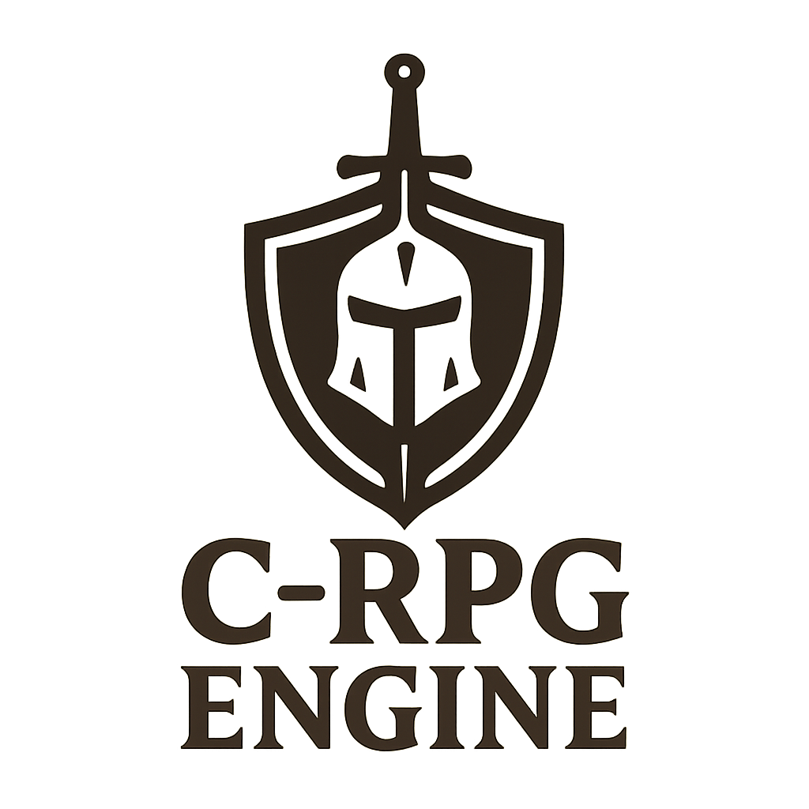

# C-RPG Engine

Este é um projeto de RPG desenvolvido em linguagem C, contendo sistemas básicos de gerenciamento de áreas, classes de personagens e componentes de jogo.

## Estrutura de Arquivos

- `Main.c`: Arquivo principal contendo a função `main()` e loop central do jogo
- `Questionario.c`: Implementação de sistemas de diálogo e questionários
- `Areas.h`: Definições de estruturas para áreas/mapas do jogo
- `Classes.h`: Definições de classes de personagens e atributos
- `Componentes.h`: Componentes gerais para mecânicas de jogo
- `output/`: Diretório contendo executáveis compilados

## Compilação e Execução

Para compilar o projeto, utilize o seguinte comando no terminal:

**Versão Original:**
```bash
gcc Main.c Questionario.c Componentes.c Classes.c Areas.c -o output/rpg_game
```

**Versão Cyberpunk (Recomendada):**
```bash
gcc Main.c Questionario.c Componentes.c Classes.c Areas.c CyberpunkStyle.c -o output/cyberpunk_rpg
```

Para executar o jogo:

**Versão Original:**
```bash
./output/rpg_game
```

**Versão Cyberpunk:**
```bash
./output/cyberpunk_rpg
```

## Funcionalidades Principais

### Sistema de Classes
- 13 classes diferentes: Guerreiro, Assassino, Bárbaro, Ladino, Clérigo, Ranger, Paladino, Mago, Bruxo, Atirador, Necromante, Cavaleiro, Druida
- Cada classe possui atributos únicos (vida, força, defesa)
- Sistema de questionário inteligente para determinar a classe ideal

### Sistema de Progressão
- **Sistema de XP**: Ganhe experiência caçando monstros
- **Level Up**: Aumente seus atributos ao subir de nível
- **Progressão Balanceada**: XP necessário aumenta progressivamente

### Sistema de Inventário
- **Coleta de Itens**: Itens dropados por monstros com stats aleatórios
- **Uso de Itens**: Sistema para usar itens e aplicar seus efeitos
- **Gestão Inteligente**: Inventário com limite e organização automática

### Sistema de Áreas
- **5 Áreas Distintas**: Cada uma com monstros e drops únicos
- **Área de Nascimento**: Determinada pela classe escolhida
- **Exploração**: Informações detalhadas sobre cada área

### Sistema de Save/Load
- **Salvamento Automático**: Salve seu progresso a qualquer momento
- **Carregamento**: Continue de onde parou automaticamente
- **Persistência**: Mantém personagem, inventário e progresso

### Interface Melhorada
- **Comandos Intuitivos**: Sistema de comandos fácil de usar
- **Feedback Visual**: Informações claras sobre ações e resultados
- **Menu de Ajuda**: Lista completa de comandos disponíveis

## Comandos Disponíveis

Durante o jogo, você pode usar os seguintes comandos:

- `hunt` - Caçar monstros na área atual e ganhar XP
- `perfil` - Ver informações detalhadas do seu personagem
- `inventario` - Visualizar itens coletados
- `usar` - Usar um item do inventário
- `area` - Ver informações da área atual
- `salvar` - Salvar o progresso do jogo
- `help` - Mostrar lista de comandos

## Melhorias Implementadas

### Correções de Bugs
- ✅ Corrigido bug do `(null)` na área de nascimento
- ✅ Corrigido vazamento de memória no sistema de nomes
- ✅ Corrigido inconsistências entre nomes de classes
- ✅ Corrigido sistema de drop rate

### Novas Funcionalidades
- ✅ Sistema completo de XP e Level Up
- ✅ Sistema de save/load funcional
- ✅ Sistema de uso de itens
- ✅ Interface melhorada com feedback visual
- ✅ Comando para visualizar área atual

### Refatoração de Código
- ✅ Separação adequada entre headers e implementações
- ✅ Organização modular do código
- ✅ Eliminação de definições múltiplas
- ✅ Melhoria na estrutura de arquivos

## Contribuição

Contribuições são bem-vindas! Sinta-se à vontade para abrir issues ou pull requests para melhorias no projeto.